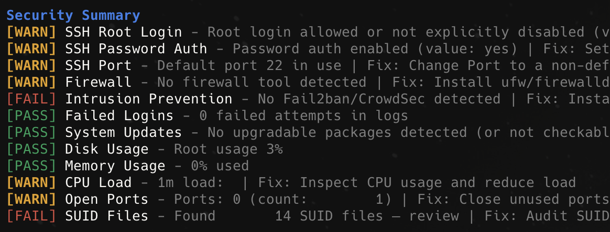

# linux-server-audit

[](https://www.gnu.org/software/bash/)
[](https://kernel.org/)
[](LICENSE)

## Preview



Lightweight VPS audit script that runs without root. It prints a colorized local log and writes a plain-text report.
Primary support is Debian and Ubuntu; other Linux distributions are best-effort.

## What it checks

- System info: OS, kernel, uptime, load, CPU, memory, disk
- Optional public IP (if `curl` is available)
- SSH configuration: root login, password auth, port
- Firewall status (ufw, firewalld, nftables, iptables)
- Intrusion prevention (Fail2ban or CrowdSec)
- Failed SSH logins (best-effort)
- Pending updates (best-effort, no root)
- Disk, memory, CPU load, open ports
- SUID binaries count in common system paths

## Requirements

- Bash
- Standard Linux userland tools (the script will skip checks if tools are missing)

## Usage

```bash
./script.sh
```

This creates a report file like:

```
hostname-audit-YYYYMMDD_HHMMSS.txt
```

## Notes

- The script is best-effort and avoids requiring root.
- Some checks depend on tool availability and log access permissions.
